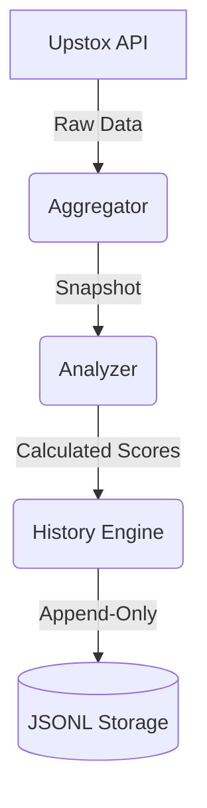

# Architecture

The Vega Fundamentals architecture is built on a decoupled, event-driven pattern designed for immutable storage and deterministic analysis.

## Key Components
1. **Queue Management:** Orchestrates fetches using a priority queue. Active jobs are persisted as transient snapshots in `storage/queue/jobs/` to separate operational state from business data.
2. **Aggregator:** Fetches fundamental sections concurrently with fail-safes and timeouts.
3. **Analyzer:** Stateless component that computes versioned scoring deterministically from snapshot data.
4. **History Engine:** Maintains immutable timeline via append-only JSONL files, managing deduplication via SHA-256 canonical hashing.
